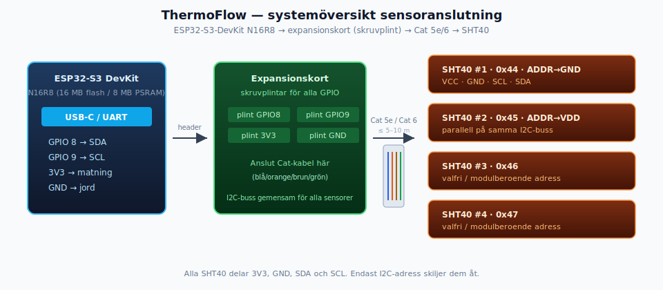
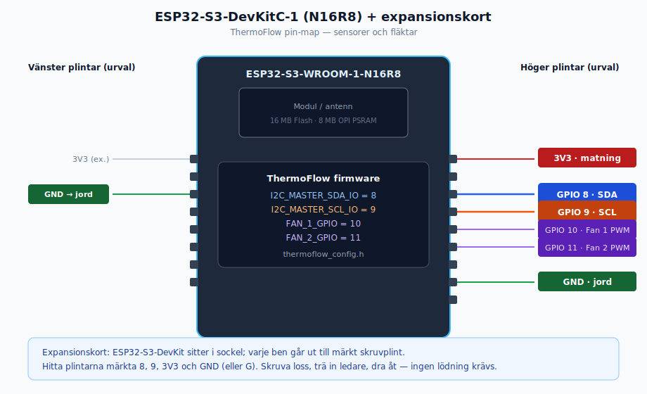
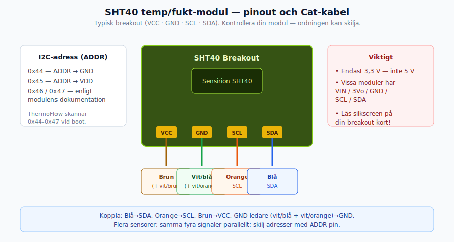
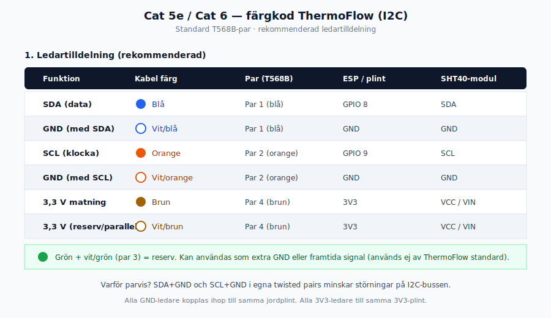
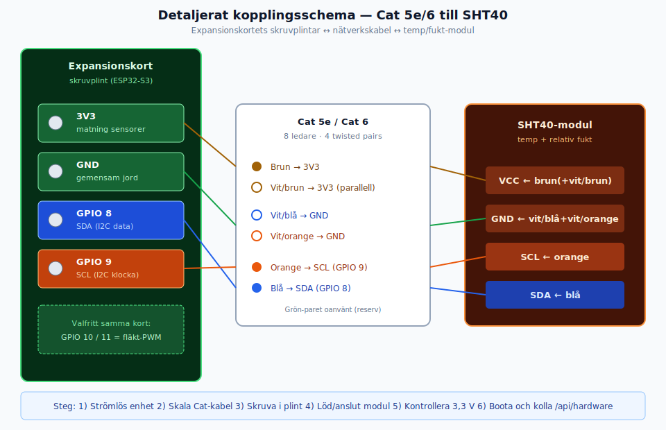
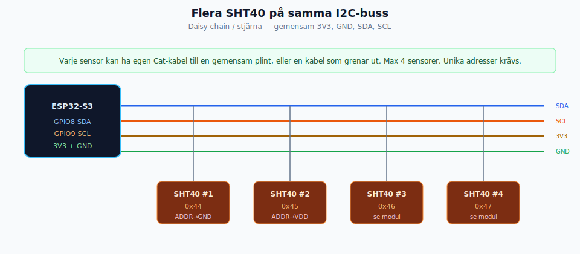

# Sensoranslutning — temp/fukt (SHT40) med Cat 5e / Cat 6

Denna guide beskriver hur du ansluter **Sensirion SHT40** temperatur- och fuktgivare till ThermoFlow via **Cat 5e** eller **Cat 6**-kabel, med **ESP32-S3-DevKit (N16R8)** monterat på ett **expansionskort med skruvplintar**.

| | |
|--|--|
| **MCU** | ESP32-S3-DevKitC-1 (eller motsvarande) med modul **N16R8** (16 MB flash, 8 MB PSRAM) |
| **Sensor** | SHT40 breakout (I2C), upp till 4 st |
| **Kabel** | Cat 5e eller Cat 6 (UTP räcker; skärmad kabel se avsnitt nedan) |
| **Firmware-pinnar** | SDA = **GPIO 8**, SCL = **GPIO 9** (`thermoflow_config.h`) |

> **OBS om kortnamn:** ThermoFlow körs på **ESP32-S3**. Märkningen *N16R8* avser flash/PSRAM på S3-modulen (t.ex. ESP32-S3-WROOM-1-N16R8). Det finns ingen separat “ESP32-S4 N16R8”-target i denna firmware.

---

## Innehåll

1. [Systemöversikt](#systemoversikt)
2. [Vad du behöver](#vad-du-behover)
3. [Pin-map: ESP32-S3 och expansionskort](#pin-map-esp)
4. [Pin-map: SHT40-modul](#pin-map-sht40)
5. [Färgkod Cat 5e / Cat 6](#fargkod-cat)
6. [Steg-för-steg montering](#steg-for-steg)
7. [Flera sensorer](#flera-sensorer)
8. [Kabellängd och I2C](#kabellangd)
9. [Verifiering](#verifiering)
10. [Felsökning](#felsokning)
11. [Diagramkatalog](#diagramkatalog)

---

## 1. Systemöversikt {#systemoversikt}

Dataflödet är:

```text
ESP32-S3 DevKit (N16R8)
        ↓  (stiftlist / sockel)
Expansionskort med skruvplintar
        ↓  (Cat 5e / Cat 6)
SHT40 temp/fukt-modul(er)
```

Alla sensorer delar **samma I2C-buss** (SDA, SCL, 3,3 V, GND). De skiljs åt med **olika I2C-adresser**.



---

## 2. Vad du behöver {#vad-du-behover}

| Del | Kommentar |
|-----|-----------|
| ESP32-S3-DevKit **N16R8** | USB-C för flash/ström under utveckling |
| Expansionskort / “breakout” med **skruvplint** | Ett ben per GPIO + 3V3 + GND |
| 1–4 × SHT40 breakout | Elektrokit, Adafruit, generisk “SHT40” |
| Cat 5e eller Cat 6 | Solid (installation) eller flex (patch) — båda funkar |
| Avisoleringstång, liten mejsel | För plintskruvar |
| Multimeter (rekommenderas) | Kontrollera 3,3 V innan sensorer ansluts länge |

**Använd inte 5 V** till SHT40-signaldelen. ThermoFlow matar sensorn med **3,3 V**.

---

## 3. Pin-map: ESP32-S3 och expansionskort {#pin-map-esp}

Firmware (se `include/thermoflow_config.h`):

| Funktion | GPIO / net | Expansionsplint (leta efter etikett) | Cat-färg (se §5) |
|----------|------------|--------------------------------------|------------------|
| I2C **SDA** | **GPIO 8** | Plint märkt **8** / **GPIO8** / **D8** | **Blå** |
| I2C **SCL** | **GPIO 9** | Plint märkt **9** / **GPIO9** / **D9** | **Orange** |
| Matning | **3V3** | Plint **3V3** / **3.3V** | **Brun** (+ vit/brun) |
| Jord | **GND** | Plint **GND** / **G** | **Vit/blå** + **vit/orange** |
| Fläkt 1 PWM *(ej sensor)* | GPIO 10 | Plint **10** | — |
| Fläkt 2 PWM *(ej sensor)* | GPIO 11 | Plint **11** | — |

### Hur du hittar rätt plint

1. Sätt DevKit i expansionskortets sockel (riktning enligt kortets silkscreen — USB-sida matchar oftast kortets “USB”-markering).
2. Läs **siffrorna** bredvid skruvplintarna. Det är ESP32-S3 GPIO-nummer, inte “Arduino D-nummer” från andra kort.
3. Använd **GPIO 8** och **GPIO 9** för I2C — samma oavsett om du har OLED (den delar bussen).



### Viktiga 3V3 / GND-plintar

De flesta expansionskort har **flera** 3V3- och GND-plintar. Använd gärna:

- en **3V3** nära GPIO 8/9 för sensorkabeln  
- en **GND** i närheten (kort returväg)

Alla GND på kortet sitter ihop internt — det räcker att ansluta jord till **en** GND-plint (men parallella jordledare i Cat-kabeln ger lägre resistans).

---

## 4. Pin-map: SHT40-modul {#pin-map-sht40}

En typisk billig SHT40-breakout har **fyra anslutningar** längs kanten:

| Modul-pin (silkscreen) | Signal | Cat-ledare | Till ESP/plint |
|------------------------|--------|------------|----------------|
| **VCC** / **VIN** / **3V3** | 3,3 V matning | Brun (+ vit/brun) | **3V3** |
| **GND** | Jord | Vit/blå + vit/orange | **GND** |
| **SCL** | I2C-klocka | Orange | **GPIO 9** |
| **SDA** | I2C-data | Blå | **GPIO 8** |



### Varianter av breakout

| Typ | Extra pinnar | Kommentar |
|-----|--------------|-----------|
| Minimal 4-pin | VCC, GND, SCL, SDA | Vanligast |
| Adafruit-liknande | VIN, 3Vo, GND, SCL, SDA | Använd **VIN** eller **3Vo** enligt datablad; matning ska vara 3,3 V-nivå som ESP |
| Med **ADDR** | ADDR / AD | Sätt till GND eller VDD för adress 0x44 / 0x45 |

**Kontrollera alltid silkscreen på din modul** — ordningen VCC–GND–SCL–SDA är vanlig men inte universell. Signalerna ovan är det som gäller elektriskt.

### I2C-adresser (ThermoFlow skannar 0x44–0x47)

| Adress | Vanlig ADDR-koppling | Sensor-slot (exempel) |
|--------|----------------------|------------------------|
| **0x44** | ADDR → **GND** | Sensor 1 |
| **0x45** | ADDR → **VDD / 3V3** | Sensor 2 |
| **0x46** | Modulberoende | Sensor 3 |
| **0x47** | Modulberoende | Sensor 4 |

Firmware: `SHT40_ADDR_A`…`D` i `thermoflow_config.h`. Vid boot skannas bussen; saknade adresser ger tomma slots (inte “felaktiga 0,0 °C”).

---

## 5. Färgkod Cat 5e / Cat 6 {#fargkod-cat}

ThermoFlow rekommenderar **T568B-par** med signal + jord i samma twisted pair:



### Snabb referens (skriv ut / tejp vid plint)

| Färg | Par | Anslut till |
|------|-----|-------------|
| **Blå** | 1 | **SDA** → GPIO **8** / modul **SDA** |
| **Vit/blå** | 1 | **GND** |
| **Orange** | 2 | **SCL** → GPIO **9** / modul **SCL** |
| **Vit/orange** | 2 | **GND** |
| **Brun** | 4 | **3V3** / modul **VCC** |
| **Vit/brun** | 4 | **3V3** (parallell matning) |
| **Grön** | 3 | Reserv (oanvänd) |
| **Vit/grön** | 3 | Reserv (oanvänd) |

### Varför just så?

- **SDA + GND** och **SCL + GND** i egna par minskar crosstalk på I2C.
- **Dubbla 3V3-ledare** (brun + vit/brun) ger lägre spänningsfall vid längre kabel.
- **Dubbla GND** (vit/blå + vit/orange) ger stabil referens.

### Minimal 4-ledarvariant (om du klipper bort par)

Om du bara använder fyra ledare:

| Färg | Funktion |
|------|----------|
| Blå | SDA |
| Orange | SCL |
| Brun | 3V3 |
| Grön | GND |

Fungerar på korta avstånd (&lt; ~2 m). För längre drag: använd full parvis jord enligt tabellen ovan.

---

## 6. Steg-för-steg montering {#steg-for-steg}



### 6.1 Förberedelse

1. **Koppla ur USB / ström** till DevKit.
2. Montera DevKit i expansionskortet.
3. Identifiera plintarna **3V3**, **GND**, **8**, **9**.
4. Kapa Cat-kabeln till önskad längd (börja gärna &lt; 3 m vid första test).

### 6.2 Skala kabeln

1. Ta bort ytterhölje ca **3–4 cm**.
2. Skilj de fyra paren; vrid inte isär mer än nödvändigt.
3. Avisolera ca **5–6 mm** på de ledare du ska använda.
4. (Valfritt) Förtenna flex-ledare lätt så de sitter bättre i plint.

### 6.3 Anslut expansionskortet (ESP-sidan)

Skruva loss plintskruven, trä in ledaren, dra åt. Dra lätt i kabeln — den ska sitta fast.

| Ledare | Plint |
|--------|-------|
| Blå | **GPIO 8** (SDA) |
| Orange | **GPIO 9** (SCL) |
| Brun + vit/brun | **3V3** (båda i samma plint eller två 3V3-plintar) |
| Vit/blå + vit/orange | **GND** |

Grön-paret tejp as ihop och lämnas oanslutet (reserv).

### 6.4 Anslut SHT40-modulen

Samma färgkod i andra änden:

| Ledare | Modul-pin |
|--------|-----------|
| Brun (+ vit/brun) | **VCC** |
| Vit/blå + vit/orange | **GND** |
| Orange | **SCL** |
| Blå | **SDA** |

Metoder: löd till hål, JST/DuPont om modulen har stiftlist, eller egen liten skruvplint.

### 6.5 ADDR (vid flera sensorer)

- Sensor 1: ADDR → GND → **0x44**  
- Sensor 2: ADDR → 3V3 → **0x45**  
- Övriga enligt modulens datablad

### 6.6 Spänningskoll (rekommenderas)

1. Anslut USB till DevKit **utan** att lämna kortslutna ledare.
2. Mät mellan **3V3** och **GND** på plint: ca **3,2–3,4 V**.
3. Mät att SDA/SCL inte sitter på 5 V-plint av misstag.

### 6.7 Starta ThermoFlow

1. Flasha firmware om det inte redan är gjort.
2. Öppna seriell monitor eller webbgränssnitt.
3. Anropa `GET /api/hardware` — sensorer ska synas som detekterade när I2C-svar finns.

---

## 7. Flera sensorer {#flera-sensorer}

Upp till **4 × SHT40** på samma buss.



### Två praktiska topologier

**A. Stjärna (rekommenderas för Cat-kabel)**  
Varje sensor har egen Cat-kabel till expansionskortets plintar (parallellkoppla 3V3/GND/SDA/SCL i plintarna — flera ledare i samma skruv om det får plats, annars använd en “fördelningsplint”).

**B. Daisy-chain**  
En Cat-kabel till första sensorn, därifrån vidare till nästa (skarv). Håll total buslängd rimlig (§8).

### Roller (exempel Mini-FTX / AC)

Se även [FTX_EXTENSION.md](FTX_EXTENSION.md) och [MOBILE_AC.md](MOBILE_AC.md). Typiskt:

| Sensor | Adress | Placering (exempel) |
|--------|--------|---------------------|
| #1 | 0x44 | Uteluft / varmsida intag |
| #2 | 0x45 | Tilluft |
| #3 | 0x46 | Frånluft |
| #4 | 0x47 | Avluft / kallsida |

Märk både kabelände och modul med tejp (“S1 0x44” osv.).

---

## 8. Kabellängd och I2C {#kabellangd}

I2C är konstruerat för korta avstånd på kretskort. Cat 5e/6 gör det **användbart** längre, men inte obegränsat.

| Längd (ungefär) | Rekommendation |
|-----------------|----------------|
| **0–2 m** | Cat 5e/6, 400 kHz (standard i firmware) OK |
| **2–5 m** | Cat 5e/6, bra jordpar; vid fel sänk I2C till 100 kHz |
| **5–10 m** | Möjligt med bra kablage; **100 kHz**, undvik starka störkällor |
| **&gt; 10–15 m** | Opålitligt med ren I2C — överväg I2C-extender / annan buss |

### Firmware-hastighet

```c
#define I2C_MASTER_FREQ_HZ   400000   // standard
// Vid lång kabel, prova:
// #define I2C_MASTER_FREQ_HZ   100000
```

i `include/thermoflow_config.h`, bygg om och flasha.

### Pull-up

ESP32-S3 har interna pull-ups aktiverade i drivern. För **långa** kablar kan externa **4,7 kΩ** (ibland 2,2 kΩ) mellan **SDA–3V3** och **SCL–3V3** behövas på expansionskortet. Många SHT40-moduler har redan pull-ups — undvik för många parallella (för lågt R).

### Cat 6 vs Cat 5e vs Cat 7

| Kabel | För sensorer |
|-------|----------------|
| **Cat 5e** | **Rekommenderas** — billig, tillräcklig |
| **Cat 6** | Lika bra / något styvare; utmärkt val |
| Cat 7 | Onödigt; skärm jorda i **ena** änden (vid ESP) om den används |

Lägg inte Cat-kabeln parallellt med nätkablar/motorledare över långa sträckor utan avstånd.

---

## 9. Verifiering {#verifiering}

1. **Seriell logg vid boot** — sök efter I2C/SHT40-detektion.  
2. **Webb-API:** `GET /api/hardware` och `GET /api/sensors`.  
3. **Rimliga värden:** rumstemperatur ~15–30 °C, RH ~20–80 % inomhus (inte exakt 0/0 eller 0/100 om det inte är meningen).  
4. **Värme-test:** håll handen vid givaren — temp ska stiga inom några avläsningar (`SENSOR_READ_INTERVAL_MS`, default 5 s).

Utan anslutna sensorer startar ThermoFlow i **simuleringsläge** (avsiktligt för bar ESP). När hårdvara detekteras ska riktiga värden användas.

---

## 10. Felsökning {#felsokning}

| Symptom | Trolig orsak | Åtgärd |
|---------|--------------|--------|
| Inga sensorer detekteras | Fel GPIO / omkastad SDA–SCL | Byt blå/orange; kontrollera plint 8 och 9 |
| Inga sensorer | Saknad GND eller 3V3 | Mät spänning; kolla plintar |
| Intermittenta fel | För lång kabel / störning | Kortare kabel, 100 kHz, externa pull-ups |
| Bara en av två sensorer | Samma I2C-adress | Olika ADDR (0x44 vs 0x45) |
| Konstiga 0,0-värden | Simulering / ogiltig kanal | Kolla `/api/sensors` + `valid`-flaggor i nyare API |
| Modul blir varm / lukt | 5 V på 3,3 V-pin | **Koppla ur omedelbart**, byt modul om skadad |
| OLED försvann när sensorer kopplades | Buss-kapacitans / konflikt | Sänk I2C-hastighet; kolla att OLED fortfarande är 0x3C |

---

## 11. Diagramkatalog {#diagramkatalog}

| Fil | Beskrivning |
|-----|-------------|
| [images/wiring-overview.svg](images/wiring-overview.svg) | Systemöversikt ESP → plint → Cat → SHT40 |
| [images/esp32-expansion-pins.svg](images/esp32-expansion-pins.svg) | GPIO 8/9/10/11 på DevKit + expansionskort |
| [images/cat5e-color-map.svg](images/cat5e-color-map.svg) | Färgkod och par-tabell |
| [images/sht40-module-pins.svg](images/sht40-module-pins.svg) | SHT40 breakout pinout |
| [images/wiring-connection-detail.svg](images/wiring-connection-detail.svg) | Detaljerat kopplingsschema plint ↔ kabel ↔ modul |
| [images/multi-sensor-bus.svg](images/multi-sensor-bus.svg) | Flera sensorer på samma I2C-buss |

SVG-filerna kan öppnas i webbläsare, VS Code, Inkscape eller bäddas in i GitHub Markdown (som ovan).

---

## Referenser i kodbasen

| Resurs | Innehåll |
|--------|----------|
| `include/thermoflow_config.h` | `I2C_MASTER_SDA_IO` (8), `I2C_MASTER_SCL_IO` (9), adresser, fläkt-GPIO |
| `components/sht4x_sensor/` | SHT40-drivrutin |
| `components/sensor_manager/` | Multi-sensor, detektion, simulering |
| [FTX_EXTENSION.md](FTX_EXTENSION.md) | Placering av 4 sensorer i FTX |
| [MOBILE_AC.md](MOBILE_AC.md) | Sensorroller mobil AC |
| [PSRAM.md](PSRAM.md) | N16R8 / 8 MB PSRAM |

---

## Snabbchecklista

- [ ] DevKit N16R8 i expansionskort, strömlöst  
- [ ] Blå → GPIO **8** (SDA) och modul **SDA**  
- [ ] Orange → GPIO **9** (SCL) och modul **SCL**  
- [ ] Brun → **3V3** / **VCC**  
- [ ] Vit/blå + vit/orange → **GND**  
- [ ] Endast 3,3 V — aldrig 5 V till SHT40  
- [ ] Unika adresser vid flera sensorer  
- [ ] `/api/hardware` visar detekterade sensorer  

När checklistan är klar är temp/fukt-givarna anslutna enligt ThermoFlow-standard med Cat 5e eller Cat 6.
